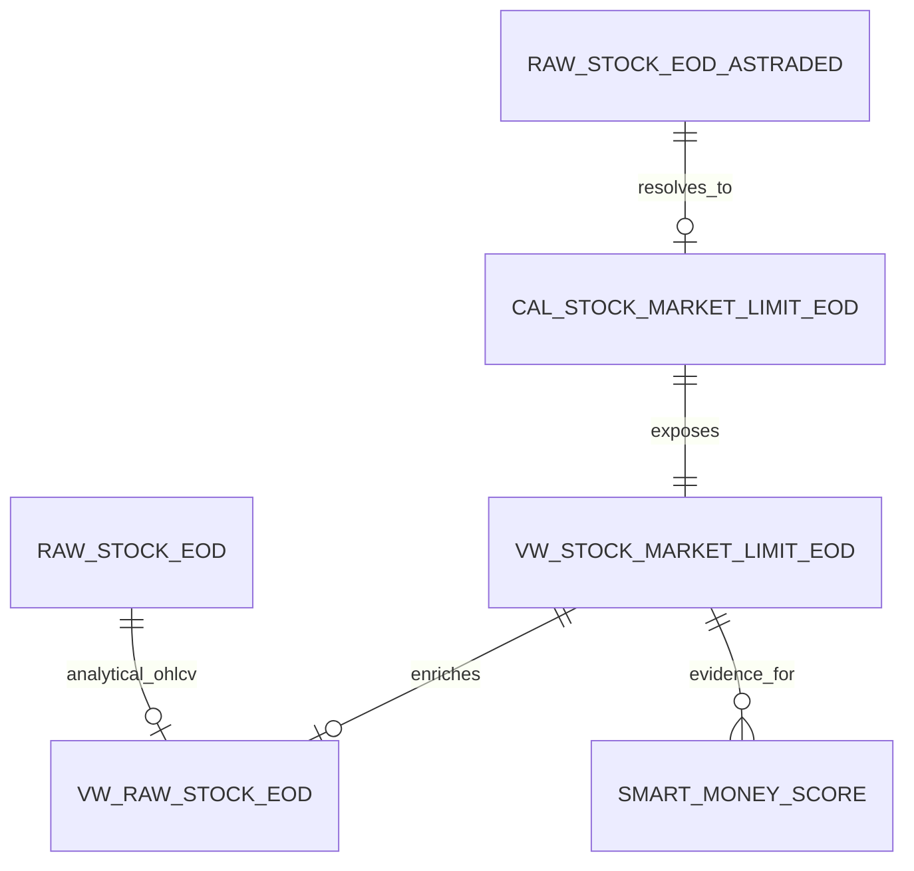

# Point-in-Time As-Traded Stock Price & Market-Limit Architecture

- **Status:** APPROVED_FOR_IMPLEMENTATION
- **Date:** 2026-09-06
- **Related:** [[SmartMoneyScore|SmartMoneyScore Architecture]]
- **ADR:** [[../adr/ADR-010-separate-adjusted-as-traded-market-limit|ADR-010]]

## Context

CherryStock currently uses `raw_stock_eod` as the canonical analytical EOD series.
That series may be historically back-adjusted after corporate actions.

This behavior is appropriate for analytical returns, MA, RS and trend calculations,
but it is not safe for point-in-time exchange facts such as:

```text
ReferencePrice
CeilingPrice
FloorPrice
LimitUp
LimitDown
LimitUpStreak
LimitDownStreak
```

A post-event back-adjustment can change historical Close values and therefore
retroactively change reconstructed reference/limit values.

The target architecture separates:

```text
Adjusted analytical price
        !=
As-traded / point-in-time market price
```

## Current Architecture

```text
raw_stock_eod (adjusted/back-adjustable)
        ↓
vw_raw_stock_eod
        ↓
derive previous Close
        ↓
Reference / Ceiling / Floor / Limit
```

This creates a historical reproducibility defect around corporate actions and other
events that change adjusted price history.

### Current ownership

- `raw_stock_eod`: analytical OHLCV owner.
- `raw_stock_intraday`: tick-level source, recent-history only.
- `raw_stock_fa.Market`: current Market snapshot, not point-in-time history.
- `vw_raw_stock_eod`: currently derives market limits from the above sources.

### Current constraint

The current derivation can be useful for recent ordinary sessions, but it MUST NOT
be treated as an authoritative historical point-in-time market-limit SSOT.

---

# Problem

SmartMoney needs stable historical market-limit evidence.

The following must remain true after a future corporate action:

```text
ReferencePrice(T)
CeilingPrice(T)
FloorPrice(T)
LimitUp(T)
LimitDown(T)
LimitUpStreak(T)
LimitDownStreak(T)
```

for a historical date T.

Recalculating these fields from an adjusted historical Close violates that contract.

---

# Proposed Architecture

```text
                     ┌────────────────────────────┐
                     │ Adjusted analytical domain │
                     └────────────────────────────┘

External adjusted source
        ↓
raw_stock_eod
        ↓
vw_Ticker_OHLC_D
        ↓
Return / MA / RS / Trend / SmartMoney market features


                     ┌────────────────────────────┐
                     │ As-traded market domain    │
                     └────────────────────────────┘

Exchange / validated as-traded provider
        ↓
raw_stock_eod_astraded
        ↓
MarketLimitResolver
        ↓
cal_stock_market_limit_eod
        ↓
vw_stock_market_limit_eod
        ├──────────────→ SmartMoney MarketLimitAdapter
        │
        └──────────────→ vw_raw_stock_eod compatibility join
```

## Source-priority policy

For one Ticker + Date, market-limit evidence is resolved in this order:

```text
1. Direct exchange-published / authoritative:
   ReferencePrice + CeilingPrice + FloorPrice + AsTradedClose

2. Validated point-in-time provider:
   same daily market facts, preserved without historical adjustment

3. Derived from as-traded source:
   HOSE/HNX ordinary-session rules only

4. UPCOM derived only when an explicit eligible regular-lot
   continuous-matching weighted-average source is available

5. Otherwise:
   Reference/Ceiling/Floor/Limit = NULL
```

The current adjusted `raw_stock_eod` MUST NOT be used as a fallback for historical
market-limit calculations.

---

# Components

## 1. AsTradedStockEODAdapter

### Responsibility

Ingest a point-in-time/unadjusted stock EOD source without retroactively adjusting
historical trade prices.

### Inputs

External provider records.

### Outputs

Normalized records for `raw_stock_eod_astraded`.

### Boundary

The adapter may normalize names/types, but MUST NOT:

- back-adjust historical prices;
- derive SmartMoney factors;
- silently synthesize authoritative ReferencePrice from adjusted data.

### Failure behavior

Missing source coverage is explicit. No fallback to `raw_stock_eod`.

---

## 2. raw_stock_eod_astraded

### Purpose

Raw/source-aligned point-in-time stock EOD facts used to resolve exchange market
limits.

### Owner / SSOT

Market-data ingestion domain.

### Grain

One source observation per:

```text
Ticker + Date + SourceCode
```

### Business key

`Ticker + Date + SourceCode`.

### Important columns

| Column | Type | Null | Meaning |
|---|---|---:|---|
| Ticker | VARCHAR | No | Security code |
| Date | DATE | No | Trading date |
| SourceCode | VARCHAR | No | Provider identity |
| Market | VARCHAR | Yes | HOSE / HNX / UPCOM at that date |
| Open | DOUBLE | Yes | As-traded Open |
| High | DOUBLE | Yes | As-traded High |
| Low | DOUBLE | Yes | As-traded Low |
| Close | DOUBLE | Yes | As-traded Close |
| Volume | BIGINT | Yes | As-traded volume |
| ReferencePrice | DOUBLE | Yes | Provider/reference price if supplied |
| CeilingPrice | DOUBLE | Yes | Provider ceiling if supplied |
| FloorPrice | DOUBLE | Yes | Provider floor if supplied |
| RegularLotVWAP | DOUBLE | Yes | Eligible UPCOM VWAP when explicitly supplied/validated |
| SessionType | VARCHAR | Yes | NORMAL / EX_RIGHT / FIRST_TRADING / RESUMPTION / SPECIAL / UNKNOWN |
| SourceTimestamp | TIMESTAMP | Yes | Provider source timestamp |
| IngestedAt | TIMESTAMP | No | Load audit timestamp |

### Integrity

- no duplicate `Ticker + Date + SourceCode`;
- prices use the same CherryStock unit convention: thousand VND/share;
- source values are not retroactively rewritten because an adjusted analytics source changed.

### History

Historical source corrections may replace the same business key, but ordinary
analytics back-adjustments MUST NOT mutate this dataset.

---

## 3. MarketLimitResolver

### Responsibility

Resolve one deterministic market-limit result per Ticker + Date.

### Inputs

- `raw_stock_eod_astraded`;
- configured source priority;
- exchange rule version;
- optional authoritative event/session data;
- CherryStock trading calendar where required.

### Outputs

`cal_stock_market_limit_eod`.

### Resolution rules

#### Direct market-limit source

If a trusted record already provides:

```text
ReferencePrice
CeilingPrice
FloorPrice
AsTradedClose
```

then preserve them and classify quality according to provider authority.

#### HOSE / HNX ordinary session

When point-in-time Market and AsTradedClose history exist and the session is
confirmed NORMAL:

```text
ReferencePrice = prior eligible AsTradedClose
Ceiling/Floor  = exchange rule + quote-unit rounding
```

#### UPCOM

Do not derive UPCOM ReferencePrice from EOD Close.

Derivation is permitted only when the source explicitly supports the required
eligible regular-lot continuous-matching weighted-average price.

Otherwise:

```text
ReferencePrice = NULL
CeilingPrice   = NULL
FloorPrice     = NULL
LimitUp        = NULL
LimitDown      = NULL
```

#### Special sessions

For:

```text
EX_RIGHT
FIRST_TRADING
RESUMPTION
SPECIAL
UNKNOWN with conflicting evidence
```

use authoritative/provider-supplied market-limit facts when available.

Do not apply ordinary previous-close rules blindly.

### Failure behavior

Missing or ambiguous evidence produces UNAVAILABLE/PARTIAL quality, never a
fabricated exact value.

---

## 4. cal_stock_market_limit_eod

### Purpose

Persist resolved, stable historical market-limit facts and their provenance.

### Owner

Market-limit calculation domain.

### Grain

One resolved result per:

```text
Ticker + Date
```

### Primary key

`Ticker + Date`.

### Important columns

| Column | Type | Null | Meaning |
|---|---|---:|---|
| Ticker | VARCHAR | No | Security |
| Date | DATE | No | Trading date |
| Market | VARCHAR | Yes | Point-in-time market |
| AsTradedClose | DOUBLE | Yes | Close used for limit state |
| ReferencePrice | DOUBLE | Yes | Resolved reference |
| CeilingPrice | DOUBLE | Yes | Resolved ceiling |
| FloorPrice | DOUBLE | Yes | Resolved floor |
| LimitUp | BOOLEAN | Yes | AsTradedClose == Ceiling |
| LimitDown | BOOLEAN | Yes | AsTradedClose == Floor |
| LimitUpStreak | BIGINT | Yes | Verified consecutive limit-up sessions |
| LimitDownStreak | BIGINT | Yes | Verified consecutive limit-down sessions |
| SessionType | VARCHAR | Yes | Session classification |
| SourceCode | VARCHAR | Yes | Selected source |
| ReferencePriceSource | VARCHAR | Yes | DIRECT / PREVIOUS_AS_TRADED_CLOSE / REGULAR_LOT_VWAP / ... |
| MarketLimitQuality | VARCHAR | No | AUTHORITATIVE / VALIDATED_PROVIDER / DERIVED_AS_TRADED / PARTIAL / UNAVAILABLE |
| RuleVersion | VARCHAR | No | Exchange-rule implementation version |
| CalculatedAt | TIMESTAMP | No | Audit |

### Null semantics

```text
FALSE = verified not at the limit
NULL  = unavailable / insufficient evidence
```

Missing evidence MUST NOT become FALSE.

### Streak semantics

A streak increments only when the current and prior required session evidence is
verified.

A missing/unverified intervening session breaks certainty:

```text
previous TRUE + current TRUE + no unverified gap -> +1
missing/unverified gap                           -> current streak restarts or NULL
FALSE                                             -> 0
```

The implementation must use the CherryStock trading calendar / eligible-session
logic rather than simple calendar-day adjacency.

---

## 5. vw_stock_market_limit_eod

### Purpose

Public point-in-time market-limit SSOT.

### Grain

One row per `Ticker + Date`.

### Source

`cal_stock_market_limit_eod`.

### Public contract

At minimum:

```text
Ticker
Date
Market
AsTradedClose
ReferencePrice
CeilingPrice
FloorPrice
LimitUp
LimitUpStreak
LimitDown
LimitDownStreak
SessionType
SourceCode
ReferencePriceSource
MarketLimitQuality
RuleVersion
```

### Consumers

- SmartMoney MarketLimitAdapter;
- validation/reconciliation;
- screeners that need true as-traded limit state;
- compatibility `vw_raw_stock_eod`.

---

## 6. vw_raw_stock_eod compatibility contract

### Responsibility

Continue exposing enriched EOD data without owning market-limit business rules.

### Target behavior

```text
raw_stock_eod
        LEFT JOIN
vw_stock_market_limit_eod
        ON Ticker + Date
```

Existing analytical OHLCV columns remain sourced from `raw_stock_eod`.

Existing market-limit fields:

```text
ReferencePrice
CeilingPrice
FloorPrice
LimitUp
LimitUpStreak
LimitDown
LimitDownStreak
```

must come from `vw_stock_market_limit_eod`.

The view MUST NOT recalculate historical market limits from adjusted Close.

The existing column order should be preserved where practical to avoid breaking
positional / `SELECT *` consumers.

---

# Logical Data Model



`raw_stock_eod` and `raw_stock_eod_astraded` intentionally represent different
business facts and are not duplicate SSOTs:

- adjusted analytical history;
- point-in-time/as-traded market history.

---

# Data Flow

## Historical / init load

```text
1. ingest full as-traded source history
2. validate source grain / market / price units
3. resolve direct market-limit facts where available
4. derive only permitted ordinary-session rules
5. persist cal_stock_market_limit_eod
6. calculate verified streaks
7. expose vw_stock_market_limit_eod
8. rebuild vw_raw_stock_eod as compatibility join
9. reconcile against external samples + known corporate-action cases
10. only then enable SmartMoney limit evidence
```

## Daily incremental

```text
as-traded source refresh
        ↓
validate latest source rows
        ↓
resolve target checkpoint + required prior sessions
        ↓
upsert market-limit checkpoint atomically
        ↓
public view
        ↓
SmartMoney
```

The incremental refresh must read enough prior verified sessions to reproduce the
same streak values as a full historical run.

---

# Contracts

## Price-domain separation

```text
raw_stock_eod.Close
    = adjusted analytical Close

raw_stock_eod_astraded.Close
    = historical as-traded Close

cal_stock_market_limit_eod.AsTradedClose
    = Close actually used for LimitUp/Down
```

No implicit substitution between these contracts is allowed.

## Quality hierarchy

```text
AUTHORITATIVE
    >
VALIDATED_PROVIDER
    >
DERIVED_AS_TRADED
    >
PARTIAL
    >
UNAVAILABLE
```

SmartMoney Confidence must consume this quality.

## No adjusted fallback

The following is prohibited:

```text
missing AsTraded / market-limit source
        ↓
fallback to adjusted raw_stock_eod.Close
        ↓
derive historical Reference/Ceiling/Floor
```

Required behavior is:

```text
missing trusted evidence
        ↓
NULL + UNAVAILABLE/PARTIAL
```

## Point-in-time requirement

All evidence for date T must be derived from data known/valid for T and earlier.

A later corporate action must not alter a persisted historical market-limit result
unless the underlying point-in-time source itself is corrected.

---

# Compatibility & Migration

## Phase 1 — Additive storage

Create new source and calculated objects without changing current consumers.

## Phase 2 — Backfill

Backfill `raw_stock_eod_astraded` and `cal_stock_market_limit_eod`.

## Phase 3 — Reconciliation gate

Required evidence includes:

- random HOSE/HNX/UPCOM ordinary sessions;
- LimitUp and LimitDown cases;
- multi-session streaks;
- known corporate-action dates;
- comparison of historical values before/after a later corporate action.

The new contract must remain stable where the adjusted source changes.

## Phase 4 — Public cutover

Create `vw_stock_market_limit_eod`.

Change `vw_raw_stock_eod` to a join-only compatibility view.

## Phase 5 — SmartMoney cutover

MarketLimitAdapter reads `vw_stock_market_limit_eod`.

Limit evidence quality determines factor availability/confidence.

## Phase 6 — Legacy logic retirement

Remove the adjusted-Close market-limit derivation only after independent validation
passes.

Do not retain two active calculation paths.

---

# Failure Handling

## Blocking

- point-in-time source cannot distinguish adjusted vs as-traded;
- duplicate source business keys;
- price-unit ambiguity;
- selected source rewrites history as adjusted prices;
- market-limit output changes after an unrelated adjusted-source corporate action;
- direct authoritative fields violate internal ordering/integrity.

## Warning / partial

- one provider missing for a subset;
- UPCOM eligible VWAP not available;
- unknown special session;
- current source provides Market but authority level is lower than exchange-published.

## Fallback

Fallback may move to a lower-quality **as-traded** source.

Fallback MUST NOT move to adjusted `raw_stock_eod`.

---

# Observability

Each refresh should report:

```text
source rows read
source rows written
tickers/dates processed
AUTHORITATIVE count
VALIDATED_PROVIDER count
DERIVED_AS_TRADED count
PARTIAL count
UNAVAILABLE count
LimitUp count
LimitDown count
streak rows
corporate-action/special-session warnings
duplicate/rejected rows
```

Data-quality results should use existing CherryStock audit patterns when their
contract fits.

---

# Validation & Testing

Minimum architecture acceptance tests:

1. adjusted historical Close may change without changing persisted historical market-limit output;
2. HOSE/HNX ordinary reference uses prior as-traded Close, not adjusted Close;
3. UPCOM without eligible reference evidence returns NULL, not EOD-Close fallback;
4. direct provider Reference/Ceiling/Floor is preserved;
5. LimitUp/Down compares against AsTradedClose;
6. missing evidence yields NULL, not FALSE;
7. streak breaks/restarts across unverified gaps;
8. no duplicate Ticker + Date final rows;
9. full backfill and incremental overlap converge;
10. public compatibility view preserves its analytical OHLCV source;
11. SmartMoney receives quality/provenance;
12. known corporate-action regression cases remain stable.

Independent validation owner: `TestEngineer.agent.md`.

---

# Implementation Handoff

Primary next owner: `GeneralCoding.agent.md`.

Expected implementation areas:

```text
src/CrawlStock/ or provider adapter
src/cherrystock/... market-data port/repository/service
src/DuckDB/sql/ market-limit schema/view SQL
scripts/initload/ historical backfill entry point
run.py / write pipeline incremental orchestration after validation
tests/ focused unit/integration/regression tests
```

Implementation outcome:

```text
IMPLEMENTED_PENDING_VALIDATION
```

Do not enable SmartMoney production LimitUp factor until TestEngineer validates the
new market-limit contract.

