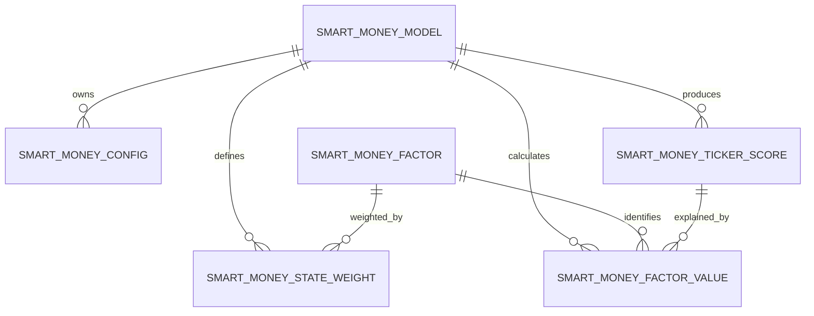

# SmartMoneyScore Architecture

- **Requirement:** REQ-0025
- **Status:** IMPLEMENTED_AND_FUNCTIONALLY_VALIDATED
- **Date:** 2026-09-06
- **ADR:** [[../adr/ADR-009-smart-money-score-state-aware-scoring|ADR-009]]

## Context

### Requirement

Build an explainable, state-aware ticker-level SmartMoneyScore that distinguishes fresh participation, accumulation, supply contraction/lock and distribution, while separating signal strength from confidence.

### Affected domains

- Market data / DuckDB.
- Technical-indicator consumption.
- Calculation engine.
- Data quality / observability.
- Screener / analytics read contracts.
- Future Sector / Industry / Custom Group aggregation.

### Repository context inspected

- `.github/agents/BusinessAnalyst.agent.md`
- `.github/agents/SolutionArchitect.agent.md`
- `docs/backlog/requirements/REQ-0025-smart-money-score.md`
- `docs/00_HOME.md`
- `docs/architecture/Data_Architecture.md`
- `docs/architecture/Indicator_Engine.md`
- `docs/reference/DB_Metadata.md`
- `.github/instructions/database.instructions.md`
- `.github/instructions/indicators.instructions.md`
- `.github/instructions/testing.instructions.md`
- `src/calcEngine/calcIndicators.py`
- current indicator metadata references including OBV / AD availability in the indicator library

## Current Architecture

### Existing market-data flow

```text
main.raw_stock_eod ------------------┬─> main.vw_Ticker_OHLC_D
main.raw_stock_intraday --------------┘          │
                                                 ├─> MarketDataAdapter
main.raw_stock_eod ------------------┬─> main.vw_raw_stock_eod
main.raw_stock_intraday ------------┤            │
main.raw_stock_fa ------------------┘             └─> MarketLimitAdapter
```

`main.vw_Ticker_OHLC_D` is the V1 market-data read contract for Smart Money.
It preserves canonical EOD OHLCV and adds daily TradingValue with provenance:

```text
Ticker
Date
Open
High
Low
Close
Volume
TradingValue
TradingValue_Source
TradingValue_IsProxy
```

TradingValue behavior:

- `INTRADAY_TICK`: reconstructed from tick Close × Volume × 1000 VND when Intraday coverage exists;
- `EOD_TYPICAL_PRICE_PROXY`: fallback `((High + Low + Close) / 3) × Volume × 1000` when Intraday coverage is missing;
- `NO_TRADE`: zero when EOD Volume is zero.

Directional Intraday fields (BuyUp/SellDown/ATO/ATC) remain optional evidence and are not fabricated for historical dates without Intraday data.

The market-data layer now exposes **derived standard-rule** market-limit evidence through
`main.vw_raw_stock_eod`:

- ReferencePrice;
- CeilingPrice;
- FloorPrice;
- LimitUp / LimitUpStreak;
- LimitDown / LimitDownStreak;
- Market and provenance/quality fields.

This is not yet an authoritative point-in-time exchange feed. `raw_stock_fa.Market`
is a current snapshot, UPCOM ReferencePrice uses an Intraday lot-100-compatible VWAP
proxy, and special-session/corporate-action rules remain unresolved. MarketCap and
FreeFloat are also not authoritative point-in-time V1 contracts.

### Existing Indicator Engine

```text
raw_stock_eod
      ↓
dim_indicator / component / config
      ↓
refresh_technical_indicators()
      ↓
cal_indicator_values          internal persistence
      ↓
vw_Ticker_indicators          public calculated-value SSOT
```

Smart Money may consume technical indicators such as MA, OBV, AD or other approved indicator configs through `vw_Ticker_indicators`.

It MUST NOT read `cal_indicator_values` directly when the public view satisfies the contract.

### Existing data-layer convention

CherryStock uses:

- `raw_*` for raw/source facts;
- `dim_*` for dimensions/configuration/master data;
- `cal_*` for calculated internal persistence;
- `vw_*` for stable downstream read contracts;
- `sys_*` for audit/monitoring.

Smart Money follows this convention.

## Problem

A single static Price × Volume formula cannot correctly distinguish:

```text
high volume + strong close       → possible demand expansion
high volume + weak close         → possible distribution
low volume + weak price          → possible lack of demand
low volume + strong persistent price
+ prior accumulation             → possible supply lock
```

The current source schema also lacks exact Trading Value and exact market-limit data. The architecture therefore needs to:

1. separate observable factors from final score;
2. detect market state before choosing score weights;
3. treat missing evidence as unavailable rather than zero;
4. separate SmartMoneyScore from ConfidenceScore;
5. preserve factor provenance so approximate liquidity data is not confused with exact flow;
6. remain backfillable and idempotent.

## Proposed Architecture

```text
                       main.raw_stock_eod
                              │
                              │ OHLCV
                              ▼
                    ┌─────────────────────┐
                    │ MarketDataAdapter   │
                    │ + BenchmarkAdapter  │
                    └─────────┬───────────┘
                              │
                  optional    │      optional
           vw_Ticker_indicators     future exact
                  │           │      market-value/
                  └─────┬─────┘      limit data
                        ▼
              ┌──────────────────────┐
              │ SmartMoneyFeature    │
              │ Engine               │
              └─────────┬────────────┘
                        ▼
              cal_smart_money_factor_values
                        │
                        ▼
              ┌──────────────────────┐
              │ Normalization Engine │
              └─────────┬────────────┘
                        ▼
              ┌──────────────────────┐
              │ StateDetectionEngine │
              └─────────┬────────────┘
                        ▼
              ┌──────────────────────┐
              │ StateAwareScoring    │
              │ Engine               │
              └─────────┬────────────┘
                        ▼
              ┌──────────────────────┐
              │ ConfidenceEngine     │
              └─────────┬────────────┘
                        ▼
              cal_smart_money_ticker_score
                        │
                        ▼
                vw_Ticker_SmartMoney
                        │
          ┌─────────────┼──────────────┐
          ▼             ▼              ▼
       Screener       Chart        Future Sector/
                                   Group Rotation
```

## Architecture Principles

1. Smart Money is a separate analytical domain, not a technical-indicator subtype.
2. Existing technical indicators are consumed through their public SSOT.
3. Factor evidence is persisted long-form.
4. Final ticker score/state is persisted separately.
5. Public consumers read a stable view, not internal factor tables.
6. Missing evidence is NULL/unavailable, never silently converted to negative evidence.
7. State-specific weights/configuration are metadata-driven.
8. A generic rule DSL is explicitly out of scope for V1; state semantics remain code-owned while thresholds/weights are configuration-owned.
9. Historical calculation is point-in-time and must not use future data.
10. SmartMoneyScore and ConfidenceScore are separate contracts.

# Components

## 1. SmartMoneyRepository

### Responsibility

Own DuckDB access for Smart Money metadata, factor persistence and final score persistence.

### Inputs

- connection/unit-of-work;
- model/config filters;
- calculated factor rows;
- calculated ticker scores.

### Outputs

- enabled model/config metadata;
- historical/current Smart Money records;
- deterministic upsert/delete-replace operations.

### Dependencies

- existing CherryStock DuckDB connection/repository pattern;
- database instructions.

### Persistence/state

Owns Smart Money `dim_*` and `cal_*` storage access.

### Failure behavior

- database write errors are blocking;
- multi-step writes participating in one refresh share a transaction;
- failed transaction rolls back factor + score changes together.

---

## 2. MarketDataAdapter

### Responsibility

Load and normalize point-in-time market inputs without embedding Smart Money business scoring.

### V1 source

`main.vw_Ticker_OHLC_D`.

### Output contract

Per ticker/date:

```text
Ticker
Date
Open
High
Low
Close
Volume
LiquidityValue
LiquidityValueQuality
LiquidityValueSource
```

### LiquidityValue contract

For V1:

```text
LiquidityValue = TradingValue
LiquidityValueSource = TradingValue_Source
```

Quality mapping:

```text
INTRADAY_TICK            -> RECONSTRUCTED_TICK
EOD_TYPICAL_PRICE_PROXY  -> PROXY
NO_TRADE                 -> OBSERVED_ZERO
```

`INTRADAY_TICK` is transaction-level reconstructed value, not claimed as an official exchange-reported TradingValue field. Historical fallback remains explicitly marked PROXY so Confidence can distinguish evidence quality.

### Failure behavior

Rows missing required OHLC fields become ineligible for factors requiring those fields; they are not globally converted to zero.

---

## 3. BenchmarkAdapter

### Responsibility

Provide a point-in-time benchmark return series for Relative Strength.

### V1 target

VNINDEX or equivalent configured benchmark series.

### Contract

```text
BenchmarkCode
Date
Close
Return5
Return20
Return60
```

### Failure behavior

Missing benchmark makes RS factors unavailable and reduces Confidence; it does not fabricate RS=0.

---

## 4. IndicatorAdapter

### Responsibility

Read optional technical-indicator evidence through `main.vw_Ticker_indicators`.

### Candidate V1 consumers

- MA20 / MA50 for trend.
- `OBV_D` for cumulative signed-volume accumulation evidence.
- `AD_D` for cumulative close-location/volume accumulation-distribution evidence.

OBV and AD Line are activated as complete D/W/M families (`OBV_D/W/M`, `AD_D/W/M`) and are calculated from full source history so incremental refresh preserves the same cumulative baseline as full backfill. SmartMoney V1 consumes the Daily configs unless a later model version explicitly uses W/M evidence.

### Boundary

The adapter resolves indicator config through public indicator metadata/contracts. Smart Money MUST NOT hard-code direct reads to `cal_indicator_values`.

OBV/AD remain optional evidence: failure or missing coverage lowers factor coverage/Confidence but does not block a minimal OHLCV + liquidity + benchmark score.

---

## 5. MarketLimitAdapter

### Responsibility

Provide point-in-time market-limit evidence with explicit quality/provenance.

### Target V1 source

`main.vw_stock_market_limit_eod`.

During migration, `main.vw_raw_stock_eod` is transitional compatibility only and MUST NOT be treated as the authoritative historical market-limit SSOT.

### V1 contract

```text
Market
ReferencePrice
ReferencePrice_Source
ReferencePrice_IsProxy
PriceBandRate
PriceBandRuleQuality
CeilingPrice
FloorPrice
LimitUp
LimitUpStreak
LimitDown
LimitDownStreak
```

### Quality semantics

The current transitional `vw_raw_stock_eod` is a **DERIVED_STANDARD_RULE** source. The approved production target is `vw_stock_market_limit_eod`, backed by point-in-time/as-traded history. Until cutover, the legacy view must not be promoted to authoritative historical evidence:

- HOSE/HNX use the nearest previous Close under ordinary-session rules;
- UPCOM uses the nearest previous eligible Intraday VWAP proxy;
- ordinary bands are HOSE 7%, HNX 10%, UPCOM 15%;
- special first-day/resumption/ex-right/corporate-action rules are not fabricated;
- current Market classification is not point-in-time historical metadata.

Therefore Smart Money may consume `LimitUp/LimitDown` as optional
`PARTIAL / DERIVED_STANDARD_RULE` evidence. It MUST NOT label these rows
`EXACT` or `AUTHORITATIVE`.

When an exchange-published daily Reference/Ceiling/Floor source is introduced,
MarketLimitAdapter may promote that source to `EXACT` without changing the public
SmartMoney output contract.

Supply Lock remains calculable from non-limit evidence when the derived limit
contract is unavailable or low quality.

---

### Price-domain separation

Adjusted analytical price and market-limit price are separate contracts:

```text
MarketDataAdapter
    -> vw_Ticker_OHLC_D
    -> adjusted analytical OHLCV

MarketLimitAdapter
    -> vw_stock_market_limit_eod
    -> AsTradedClose + Reference/Ceiling/Floor/Limit
```

SmartMoney MUST NOT compare adjusted `Close` to an as-traded Ceiling/Floor when
determining LimitUp/Down. Limit state is supplied by the MarketLimitAdapter.

## 6. SmartMoneyFeatureEngine

### Responsibility

Calculate raw point-in-time factors.

### Required inputs

- OHLCV;
- relative liquidity;
- benchmark;
- optional indicator evidence;
- prior state/memory where required.

### Core raw features

#### Returns

```text
Return1
Return5
Return20
Return60
```

#### Close Location Value

For `High != Low`:

```text
CLV = ((Close - Low) - (High - Close)) / (High - Low)
```

Range is approximately `[-1, 1]`.

For `High == Low`, CLV is unavailable unless a separate exact locked-price rule applies. It MUST NOT divide by zero.

#### Relative Liquidity

Using `LiquidityValue`:

```text
ALV5  = average LiquidityValue over previous/current 5 eligible sessions
ALV20 = average LiquidityValue over previous/current 20 eligible sessions
ALV60 = average LiquidityValue over previous/current 60 eligible sessions

RVAL20 = LiquidityValue / ALV20
LiquidityAcceleration = ALV5 / ALV20
LiquidityAccelerationLong = ALV20 / ALV60
```

The implementation must define inclusive/exclusive window semantics once and test them deterministically. No future session may enter a historical window.

#### Relative Strength

```text
RS5  = Return5Ticker  - Return5Benchmark
RS20 = Return20Ticker - Return20Benchmark
RS60 = Return60Ticker - Return60Benchmark
```

#### Price Strength

Candidate composite evidence includes:

- Return percentile;
- Close location;
- distance/position relative to trend;
- persistence near recent highs.

#### Volume / Liquidity Compression

Supply contraction should use a bounded measure such as:

```text
LiquidityCompression =
1 - clip(ALV3_or_ALV5 / ALV20, 0, 1)
```

Compression alone is not bullish.

---

## 7. NormalizationEngine

### Responsibility

Convert comparable raw factor values to `0..100` without embedding market-state semantics.

### V1 default

Cross-sectional percentile over the eligible active universe for the same `Date`.

### Rules

- direction must be explicit per factor;
- unavailable factors remain NULL;
- insufficient universe coverage yields a data-quality warning and lower Confidence;
- outliers must not cause score values outside `0..100`.

### Why percentile for V1

- robust to scale differences;
- easy to compare tickers;
- less sensitive to outliers than unbounded z-score;
- suitable for mixed-price/liquidity universe.

Future research may introduce robust z-score or regime-specific normalization through model versioning.

---

## 8. AccumulationEngine

### Responsibility

Calculate `AccumulationScore` and `AccumulationMemoryScore`.

### Accumulation evidence

V1 may combine normalized evidence from:

- CLV persistence;
- Relative Strength;
- Liquidity behavior;
- price compression/breakout structure;
- OBV slope when available;
- AD slope when available.

Weights are configuration-owned and versioned.

### Memory formula

Recommended initial behavior:

```text
Memory_t =
    lambda * Memory_(t-1)
  + (1-lambda) * AccumulationScore_t
```

Initial candidate:

`lambda = 0.90`.

The exact configured value belongs to model configuration and may change only under a new config/model version.

### Historical determinism

Full backfill seeds memory from the earliest eligible history.

Incremental refresh must read/recompute enough prior sessions to reproduce the same memory value as a full run.

---

## 9. SupplyLockEngine

### Responsibility

Detect bullish supply contraction without assuming low volume is positive by itself.

### Positive evidence

Supply Lock should require combined evidence from:

- high PriceStrength;
- high CLV / persistent close near daily or recent highs;
- positive Relative Strength;
- positive Trend;
- high LiquidityCompression;
- low DistributionScore;
- optionally high AccumulationMemory;
- optionally exact LimitUpScore.

Conceptually:

```text
SupplyLockRaw =
PriceStrength
× CloseStrength
× RelativeStrength
× LiquidityCompression
× nonDistributionGate
```

Implementation may use weighted/minimum-gated combination instead of literal multiplication if validation demonstrates better numerical behavior. The semantic requirement is conjunctive: liquidity compression cannot generate Supply Lock alone.

### Missing exact limit-up

If exact market-limit evidence is unavailable:

- SupplyLockScore is still calculable from non-limit factors;
- LimitUpScore remains NULL;
- final positive weights are renormalized over available factors;
- Confidence is lower because factor coverage is incomplete.

---

## 10. LimitUpEvidence

### Responsibility

Represent exact limit-up evidence only when trusted market-limit data exists.

### Values

```text
IsLimitUp
LimitUpStreak
LimitUpScore
```

### Saturating streak

Use a saturating function rather than unlimited linear growth, for example:

```text
LimitUpScore = 100 * (1 - exp(-k * streak))
```

`k` is configuration-owned.

A missing exact source produces NULL, not 0.

---

## 11. DistributionEngine

### Responsibility

Create explicit negative evidence.

### Candidate inputs

- elevated relative liquidity;
- negative/weak Return;
- Close near Low / low CLV;
- deteriorating Relative Strength;
- upper rejection / failed breakout where detectable.

Conceptually:

```text
DistributionRaw =
LiquidityExpansion
× PriceWeakness
× CloseNearLow
```

Normalize to `DistributionScore 0..100`.

Distribution is a penalty, not simply the absence of positive factors.

---

## 12. StateDetectionEngine

### Responsibility

Assign one primary state using normalized factors and configured thresholds.

### V1 state set

```text
ACCUMULATION
BREAKOUT
DEMAND_EXPANSION
SUPPLY_LOCK
MARKUP
DISTRIBUTION
LIQUIDITY_DRYUP
SELLING_CLIMAX
NEUTRAL
```

### Design boundary

V1 does not introduce a generic user-authored rule DSL.

Code owns the meaning/structure of states.

Configuration owns:

- thresholds;
- minimum confirmations;
- persistence/hysteresis parameters;
- factor enablement.

### Initial precedence

When multiple state rules match, use deterministic precedence:

```text
DISTRIBUTION
SUPPLY_LOCK
BREAKOUT
DEMAND_EXPANSION
ACCUMULATION
MARKUP
SELLING_CLIMAX
LIQUIDITY_DRYUP
NEUTRAL
```

Precedence is versioned configuration/contract and must be covered by unit tests.

A future design may replace hard precedence with multi-label state evidence, but V1 persists one primary state plus component scores.

---

## 13. StateAwareScoringEngine

### Responsibility

Calculate positive Smart Money evidence using the weight profile of the detected state.

### General formula

For available positive factors:

```text
AvailableWeight = sum(weight_i for factor_i not NULL)

PositiveScore =
    sum(weight_i * factor_i for available factors)
    / AvailableWeight
```

If `AvailableWeight` is below configured minimum coverage, calculation is either skipped or returned with low Confidence according to config.

Distribution penalty:

```text
SmartMoneyScore =
clip(
    PositiveScore
    - DistributionPenaltyFactor(state) * DistributionScore,
    0,
    100
)
```

### Why renormalize missing positive factors

Missing evidence is not negative evidence.

Example: no exact market-limit source should not force `LimitUpScore=0` and incorrectly depress a Supply Lock score.

Confidence separately captures that the evidence set is incomplete.

### Initial state profiles

These are initial configuration defaults, not immutable business truth.

#### NEUTRAL / normal-flow profile

```text
FreshFlow              30%
RelativeLiquidity      15%
LiquidityAcceleration  15%
RelativeStrength       15%
Accumulation           15%
Trend                  10%
```

#### ACCUMULATION

```text
Accumulation           30%
AccumulationMemory     20%
RelativeStrength       15%
LiquidityBehavior      15%
FreshFlow              10%
Trend                   10%
```

#### BREAKOUT / DEMAND_EXPANSION

```text
FreshFlow              25%
RelativeLiquidity      20%
LiquidityAcceleration  20%
RelativeStrength       15%
AccumulationMemory     10%
Trend                   10%
```

#### SUPPLY_LOCK

```text
AccumulationMemory     25%
SupplyLock             25%
LimitUp                20%
RelativeStrength       15%
Trend                   10%
FreshFlow                5%
```

If `LimitUp` is unavailable, the remaining available weights are renormalized; Confidence records the missing evidence.

---

## 14. ConfidenceEngine

### Responsibility

Evaluate trustworthiness of the score, not direction/strength of Smart Money.

### Candidate dimensions

```text
DataCompleteness
FactorCoverage
LiquidityAdequacy
HistoryDepth
BenchmarkAvailability
ExactLiquidityValueQuality
MarketLimitEvidenceAvailability
FactorAgreement
PriceImpactRisk
```

### Output

`ConfidenceScore 0..100`.

### Illiquidity control

Current V1 lacks authoritative MarketCap/FreeFloat. Therefore Confidence must first rely on observable liquidity/history features such as:

- median/average Volume or LiquidityValue proxy;
- number of active trading sessions;
- gaps/missing days;
- extreme return relative to normal participation;
- cross-sectional liquidity percentile.

Future MarketCap/FreeFloat data can become additional confidence features without changing SmartMoneyScore semantics.

A high SmartMoneyScore with very low liquidity is permitted but should produce lower Confidence.

---

# Data Model

## Logical model



The relationship between score and factor rows is through:

`ModelId + Ticker + Date`.

---

## 1. main.dim_smart_money_model

### Purpose

Master/version identity for one executable Smart Money model family.

### Owner / SSOT

Smart Money domain metadata.

### Grain

One row per model version/effective version.

### Proposed columns

| Column | Type | Null | Meaning |
|---|---|---:|---|
| ModelId | BIGINT | No | Surrogate key |
| ModelCode | VARCHAR | No | Stable model family code |
| ModelVersion | VARCHAR | No | Human-readable version |
| Description | VARCHAR | Yes | Model purpose |
| IsEnabled | BOOLEAN | No | Executable status |
| EffectiveFrom | DATE | Yes | Effective start |
| EffectiveTo | DATE | Yes | Effective end |
| CreatedAt | TIMESTAMP | No | Audit timestamp |
| UpdatedAt | TIMESTAMP | No | Audit timestamp |

### Keys / integrity

- PK: `ModelId`.
- Unique: `ModelCode + ModelVersion`.
- only one enabled effective version per ModelCode/date.

---

## 2. main.dim_smart_money_factor

### Purpose

Canonical factor definitions.

### Grain

One row per factor code.

### Proposed columns

| Column | Type | Null | Meaning |
|---|---|---:|---|
| FactorId | BIGINT | No | PK |
| FactorCode | VARCHAR | No | e.g. FRESH_FLOW, RVAL20, SUPPLY_LOCK |
| FactorName | VARCHAR | No | Display name |
| Category | VARCHAR | No | FLOW / LIQUIDITY / STRENGTH / STATE / RISK |
| NormalizationMethod | VARCHAR | No | V1 default PERCENTILE |
| ContributionType | VARCHAR | No | POSITIVE / PENALTY / CONFIDENCE / EVIDENCE |
| IsEnabled | BOOLEAN | No | Active factor |
| Description | VARCHAR | Yes | Semantics |

### Integrity

- PK: `FactorId`.
- Unique: `FactorCode`.

---

## 3. main.dim_smart_money_config

### Purpose

Versioned executable parameters without hard-coding thresholds in orchestration.

### Grain

One config key for one model version/effective period.

### Proposed columns

| Column | Type | Null | Meaning |
|---|---|---:|---|
| ModelId | BIGINT | No | FK model |
| ConfigKey | VARCHAR | No | e.g. MEMORY_LAMBDA |
| ConfigValue | VARCHAR | No | serialized scalar/JSON |
| ValueType | VARCHAR | No | FLOAT / INT / BOOL / JSON / STRING |
| EffectiveFrom | DATE | Yes | Start |
| EffectiveTo | DATE | Yes | End |
| UpdatedAt | TIMESTAMP | No | Audit |

### Key

`ModelId + ConfigKey + EffectiveFrom`.

Implementation validates typed value before execution.

---

## 4. main.dim_smart_money_state_weight

### Purpose

Metadata-driven weight profile by model + market state + factor.

### Grain

One factor weight for one model/state/effective period.

### Proposed columns

| Column | Type | Null | Meaning |
|---|---|---:|---|
| ModelId | BIGINT | No | FK |
| MarketState | VARCHAR | No | State code |
| FactorId | BIGINT | No | FK |
| Weight | DOUBLE | No | Positive configured weight |
| EffectiveFrom | DATE | Yes | Start |
| EffectiveTo | DATE | Yes | End |
| UpdatedAt | TIMESTAMP | No | Audit |

### Integrity

- Unique logical key: `ModelId + MarketState + FactorId + EffectiveFrom`.
- enabled positive-factor weights for one state should total approximately 1.0 before missing-factor renormalization.
- negative Distribution penalty is configuration, not represented as a positive factor weight unless explicitly modeled as ContributionType=PENALTY.

---

## 5. main.cal_smart_money_factor_values

### Purpose

Internal long-form factor persistence and audit lineage.

### Owner

Smart Money calculation engine.

### Grain

One factor value for one:

`ModelId + Ticker + Date + FactorId`.

### Proposed columns

| Column | Type | Null | Meaning |
|---|---|---:|---|
| ModelId | BIGINT | No | Model identity |
| Ticker | VARCHAR | No | Security |
| Date | DATE | No | As-of trading date |
| FactorId | BIGINT | No | Factor |
| RawValue | DOUBLE | Yes | Raw calculation |
| NormalizedValue | DOUBLE | Yes | 0..100 when applicable |
| DataQuality | VARCHAR | No | EXACT / PROXY / PARTIAL / UNAVAILABLE |
| SourceCode | VARCHAR | Yes | RAW_OHLCV / INDICATOR / BENCHMARK / MARKET_LIMIT |
| CalculatedAt | TIMESTAMP | No | Audit |

### Key

Unique:

`ModelId + Ticker + Date + FactorId`.

### History

Historical rows are version-specific through ModelId/model version.

Rerun at the same logical key replaces/upserts, not appends duplicate values.

---

## 6. main.cal_smart_money_ticker_score

### Purpose

Internal persistence of final ticker/date state and score.

### Grain

One result per:

`ModelId + Ticker + Date`.

### Proposed columns

| Column | Type | Null | Meaning |
|---|---|---:|---|
| ModelId | BIGINT | No | Model |
| Ticker | VARCHAR | No | Security |
| Date | DATE | No | As-of date |
| SmartMoneyScore | DOUBLE | No | 0..100 |
| ConfidenceScore | DOUBLE | No | 0..100 |
| MarketState | VARCHAR | No | Primary state |
| FactorCoverage | DOUBLE | No | 0..1 |
| DataQualityStatus | VARCHAR | No | PASS / WARNING / INVALID |
| CalculatedAt | TIMESTAMP | No | Audit |

### Key

Unique:

`ModelId + Ticker + Date`.

### Integrity

- SmartMoneyScore between 0 and 100.
- ConfidenceScore between 0 and 100.
- FactorCoverage between 0 and 1.
- MarketState in supported state set.

---

## 7. main.vw_Ticker_SmartMoney

### Purpose

Public/downstream Smart Money Single Source of Truth.

### Grain

One latest-enabled-model row per Ticker + Date.

### Columns

At minimum:

```text
Ticker
Date
ModelCode
ModelVersion
SmartMoneyScore
ConfidenceScore
MarketState
FactorCoverage
DataQualityStatus

FreshFlowScore
RelativeLiquidityScore
LiquidityAccelerationScore
RelativeStrengthScore
AccumulationScore
AccumulationMemoryScore
SupplyLockScore
LimitUpScore
TrendScore
DistributionScore
```

### Source

Join:

- `cal_smart_money_ticker_score`;
- enabled/effective `dim_smart_money_model`;
- pivoted selected component rows from `cal_smart_money_factor_values`.

### Boundary

The wide component columns in the view are presentation/read convenience.

The long-form `cal_smart_money_factor_values` remains the internal component-value owner, avoiding duplicate persisted SSOT.

Future sector engines should consume this view unless a more specific public Smart Money contract is introduced.

---

# Data Flow

## Daily incremental flow

```text
1. Price refresh completes
2. validate raw_stock_eod
3. refresh technical indicators if configured Smart Money factors require them
4. resolve enabled Smart Money model/config
5. resolve checkpoint + warmup history
6. load OHLCV + benchmark + optional indicator/market-limit evidence
7. calculate raw factor values
8. normalize cross-section for target dates
9. calculate accumulation memory
10. calculate Supply Lock / Distribution / other state evidence
11. detect primary state
12. load state-specific weights
13. calculate SmartMoneyScore
14. calculate ConfidenceScore
15. validate output
16. atomic upsert factor + ticker-score persistence
17. expose via vw_Ticker_SmartMoney
18. persist/log data-quality summary
```

## Ordering with Indicator Engine

Smart Money is allowed to calculate purely from OHLCV, but when enabled config consumes MA/OBV/AD from Indicator Engine:

```text
raw price
   ↓
refresh_technical_indicators()
   ↓
vw_Ticker_indicators
   ↓
refresh_smart_money_score()
```

`run.py` remains orchestration only and must not contain one hard-coded branch per Smart Money factor.

---

# Historical / Incremental Contract

Implemented public engine entry point:

```text
refresh_smart_money_score(
    from_last_day=None,
    tickers=None,
    model_ids=None,
    connection=None,
    repository=None
)
```

Supported execution modes:

- `from_last_day=None` — full historical backfill;
- `from_last_day=N` — bounded checkpoint refresh;
- optional ticker persistence subset;
- optional model subset;
- caller-owned connection/repository.

## Two-stage incremental warmup

Incremental execution uses separate feature and memory boundaries:

```text
feature_start
    ↓  mature up to 60-session rolling features
memory_start
    ↓  resume from persisted AccumulationMemory seed
target_start
    ↓  replace checkpoint rows only
source_end
```

Default boundary spacing is approximately 70 market sessions from
`feature_start -> memory_start` and another approximately 70 sessions from
`memory_start -> target_start`.

This separation is required because replaying AccumulationMemory from rows whose
own RS60/ALV60 inputs are not yet mature creates a small but systematic divergence
from full-history results.

Same-date percentile normalization continues to use the complete active universe
for every calculated date. A ticker subset limits persistence, not the
normalization universe.

Synthetic DuckDB integration validates full-history/incremental convergence with
tight numerical tolerance.

---

# Contracts

## Factor availability

Use three semantics distinctly:

```text
0 score       = observed negative/weak evidence
NULL          = factor unavailable/not calculable
DataQuality   = quality/provenance of the evidence
```

Do not conflate these states.

## Score range

`SmartMoneyScore`, `ConfidenceScore`, and normalized component scores are clamped to `0..100`.

## Factor coverage

```text
FactorCoverage =
sum(configured positive weight of available factors)
/
sum(configured positive weight)
```

This contributes to Confidence.

## Provenance

At least relative-liquidity factors record whether the source was:

- EXACT;
- PROXY.

## No look-ahead

All features for date T must be derived only from observations whose date is `<= T`.

Cross-sectional normalization for T may use other eligible tickers at T, never later dates.

---

# Compatibility & Migration

## Additive database change

V1 introduces new Smart Money `dim_*`, `cal_*`, and `vw_*` objects.

It does not alter:

- `raw_stock_eod`;
- `cal_indicator_values`;
- `vw_Ticker_indicators`;
- existing indicator metadata semantics.

## Source-data gap strategy

### Trading Value

Current V1 consumes `main.vw_Ticker_OHLC_D.TradingValue`.

Source quality is explicit:

- recent dates with Intraday coverage use `INTRADAY_TICK` reconstructed transaction value;
- older dates without Intraday use `EOD_TYPICAL_PRICE_PROXY`;
- zero-trade dates use `NO_TRADE`.

Relative-liquidity factors must preserve this provenance in DataQuality/Confidence. The proxy must never be presented as official exchange trading value.

When a future authoritative TradingValue source is introduced, MarketDataAdapter may promote that source to EXACT without changing RelativeLiquidity factor semantics or downstream public contracts.

### Market-limit data

The current SmartMoney runtime does **not** consume transitional
`main.vw_raw_stock_eod` LimitUp/LimitUpStreak evidence for production scoring.

The optional adapter activates only when the approved point-in-time public contract
exists:

```text
main.vw_stock_market_limit_eod
```

Accepted runtime quality values are:

```text
AUTHORITATIVE
VALIDATED_PROVIDER
DERIVED_AS_TRADED
```

If that view is absent, or evidence is not trusted:

```text
LimitUpScore = NULL
DataQuality  = UNAVAILABLE
```

Missing market-limit evidence is therefore missing evidence, not a bearish zero.
Legacy adjusted/current-snapshot-derived `vw_raw_stock_eod` must not be silently
promoted into the SmartMoney production factor.

## Rollout

Implementation artifacts now exist for metadata/storage, runtime calculation,
historical initload, bounded incremental refresh, public view and independent
validation.

Functional validation gate is complete:

1. focused unit tests — PASS;
2. full historical initload — PASS;
3. `smart_money_v1_preflight.sql` — PASS;
4. full/incremental convergence — PASS;
5. TestEngineer terminal verdict — PASS / KEEP.

Production auto-run remains intentionally gated by OOS calibration review:

6. execute `scripts/evaluate_smart_money_v1.py --horizons 5 10 20`;
7. review TRAIN / VALIDATION / TEST evidence;
8. only after explicit OOS review, set `SMART_MONEY_AUTO_RUN=true`;
9. normal `run.py` then appends SmartMoney after Trend / Indicator Engine.

Default remains:

```text
SMART_MONEY_AUTO_RUN=false
```

so implementation cannot silently activate production scoring before independent
validation.

---

# Failure Handling & Observability

## Blocking

- missing enabled model/config contract;
- duplicate factor logical keys;
- invalid weight profile;
- output score outside contract after validation;
- transaction/persistence failure;
- unavailable required OHLC source for all target tickers.

## Warning / partial

- missing optional indicator factor;
- missing benchmark for a subset;
- missing exact market-limit evidence;
- use of PROXY liquidity value;
- insufficient factor coverage above minimum but below preferred threshold;
- low liquidity/history confidence.

## Execution summary

Return/log at minimum:

```text
status
model(s)
date range
tickers requested
tickers processed
tickers skipped
factor rows upserted
score rows upserted
warning count
invalid count
proxy liquidity count
low confidence count
state distribution
```

Data-quality results should integrate with existing `validate_data_quality()` / `persist_data_quality_result()` patterns where the storage contract fits.

---

# Validation & Testing

Validation owner: `TestEngineer.agent.md`.

## Unit tests

Minimum focused tests:

1. CLV normal case and High==Low.
2. RVAL / liquidity acceleration no-look-ahead window.
3. cross-sectional percentile normalization.
4. accumulation memory decay and deterministic seed.
5. Supply Lock requires price/strength confirmation; compression alone fails.
6. Supply Lock remains strong when current volume is low but prior accumulation/strength are high.
7. Distribution increases on high liquidity + weak close.
8. exact LimitUpScore NULL when authoritative market-limit data is absent.
9. limit-up saturating streak when source is available.
10. missing factor weight renormalization.
11. score clamp 0..100.
12. Confidence decreases with poor factor coverage / proxy evidence / illiquidity.
13. deterministic state precedence.
14. no future data leakage.

## Integration tests

1. DuckDB metadata seed and config load.
2. factor persistence logical-key uniqueness.
3. ticker-score upsert idempotency.
4. shared transaction rollback on failure.
5. public `vw_Ticker_SmartMoney` returns expected latest model/component values.
6. optional read from `vw_Ticker_indicators`.
7. targeted ticker/date run.
8. incremental run vs equivalent full-history overlap.

## Scenario tests

At least:

### A. Demand expansion

```text
price ↑
relative liquidity ↑
Close near High
RS ↑
```

Expected: positive FreshFlow / Demand Expansion.

### B. Distribution

```text
liquidity ↑
price weak/down
Close near Low
RS ↓
```

Expected: high Distribution and lower SMS.

### C. Supply Lock

```text
prior accumulation high
trend/RS strong
price near High
liquidity compression
```

Expected: SUPPLY_LOCK possible even when current Fresh Flow is low.

### D. Illiquid spike

Expected: high raw SMS may occur; Confidence low.

### E. Missing exact ceiling data

Expected: LimitUpScore NULL, not guessed/zero; SupplyLock still calculable.

---

# Source of Truth and Ownership

| Concept | Owner / SSOT |
|---|---|
| OHLCV owner | `raw_stock_eod` |
| Smart Money market-data read contract | `vw_Ticker_OHLC_D` |
| Active ticker universe | current `raw_lstTicker` contract |
| Technical indicator values | `vw_Ticker_indicators` |
| Smart Money model/config | Smart Money `dim_*` |
| Smart Money factor values | `cal_smart_money_factor_values` internal persistence |
| Final Smart Money ticker score | `cal_smart_money_ticker_score` internal persistence |
| Downstream Smart Money read contract | `vw_Ticker_SmartMoney` |

Smart Money does not become a second SSOT for OHLCV or technical indicators.

---

# Implementation Handoff

Primary next owner:

`.github/agents/GeneralCoding.agent.md`.

Affected areas expected during implementation:

```text
src/calcEngine/smartMoney/**
src/cherrystock/infrastructure/database/repositories/**
src/DuckDB/sql/**
run.py or approved orchestration owner
tests/**
docs/reference/DB_Metadata.md regeneration after DB migration
```

Implementation must preserve this architecture and end with:

`IMPLEMENTED_PENDING_VALIDATION`.

Independent final validation belongs to TestEngineer.

# ADR

**Required.**

Reason: this introduces a new cross-module calculation domain, new persisted/public data contracts, state-aware scoring semantics and an explicit decision to separate signal from confidence while keeping factor values outside Indicator Engine persistence.

See:

[[../adr/ADR-009-smart-money-score-state-aware-scoring|ADR-009 — SmartMoneyScore State-Aware Scoring and Data Contracts]]


## Implementation Status

Current state:

```text
IMPLEMENTED_AND_FUNCTIONALLY_VALIDATED
REQ-0025 = DONE
TestEngineer = PASS / KEEP
OOS calibration review = PENDING
```

Implemented runtime:

- `src/calcEngine/smartMoneyScore.py`
- `src/cherrystock/infrastructure/database/repositories/smart_money_repository.py`
- `src/DuckDB/sql/smart_money_v1_schema.sql`
- `src/DuckDB/sql/smart_money_v1_preflight.sql`
- `scripts/initload/init_reload_smart_money_score.py`
- `scripts/run_smart_money.py`
- `scripts/validate_smart_money_incremental.py`
- `tests/test_smart_money_score.py`
- `tests/test_smart_money_evaluation.py`
- `tests/test_smart_money_integration.py`
- `.github/workflows/smart-money-validation.yml`
- `docs/runbook/SmartMoneyScore_V1.md`

Final validation owner remains TestEngineer. Predictive effectiveness/calibration
is a research/evaluation gate and must not be confused with implementation
correctness.


## Historical Effectiveness Evaluation

Implementation correctness and predictive usefulness are separate gates.

The research evaluator:

```text
src/calcEngine/smartMoneyEvaluation.py
scripts/evaluate_smart_money_v1.py
```

uses chronological `TRAIN / VALIDATION / TEST = 60% / 20% / 20%` and computes
forward 5/10/20-session stock returns, VNINDEX returns and excess returns for:

- SmartMoneyScore buckets;
- MarketState;
- Confidence buckets.

A future horizon is defined by the exact VNINDEX trading-session date H bars after
the score date. A ticker without a Close on that date has an unavailable label.

Evaluation output is research-only and MUST NOT mutate production model weights,
persisted scores or `SMART_MONEY_AUTO_RUN`.

V1 does not hard-code a promotion threshold because no approved business
effectiveness threshold exists yet. Validation/Test evidence must be reviewed
explicitly before claiming the initial state weights are calibrated.


## CI Integration Evidence

Latest focused SmartMoney CI gate:

```text
Workflow:   .github/workflows/smart-money-validation.yml
Run:        34027575109
Run number: 6
Commit:     9b352782f237f67938dc25ebcf95fb60de54be46
Result:     SUCCESS
Tests:      12 passed
Python:     3.13
DuckDB:     1.5.5
```

The synthetic integration executes SmartMoney schema bootstrap twice, executes the
preflight SQL, performs full historical refresh, validates the public view and NULL
LimitUp semantics, then verifies bounded incremental convergence against the full
baseline.


## Local Production-Like Validation Evidence

Executed against the real local CherryMon database on 2026-09-06:

```text
Full historical scores:  1,111,784
Factor rows:             11,117,840
Source coverage:         2000-07-28 → 2026-09-04
Preflight:               13/13 PASS
Convergence sample:      MWG / FPT / HPG
Convergence score rows:  60
Convergence factor rows: 600
Memory seeds:            349
Verdict:                 PASS
Action:                  KEEP
```

Functional architecture is therefore validated on both synthetic CI and the real
local CherryMon dataset.

The remaining OOS evaluation is intentionally treated as a model-calibration /
production-activation gate, not a correctness gate.
